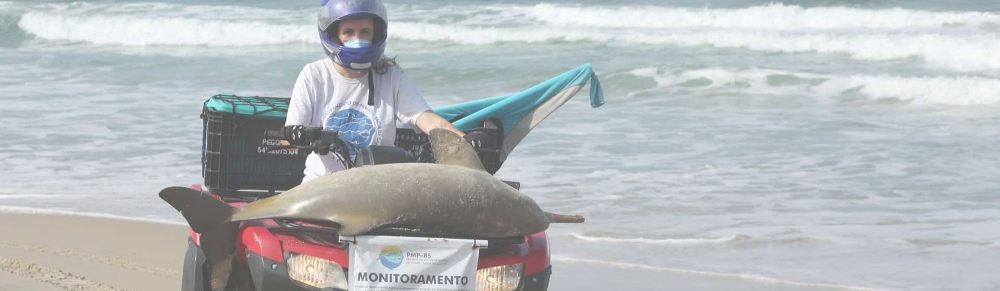

# Análise de Registros da Fauna Marinha e Costeira - BR (2020 - 2024)

### Clique [aqui](https://app.powerbi.com/view?r=eyJrIjoiMmU0ZTIxM2EtZGZjMS00OThmLWIzOGYtMmZjMWU1MTU3ZGY1IiwidCI6ImUyZjc3ZDAwLTAxNjMtNGNmNi05MmIwLTQ4NGJhZmY5ZGY3ZCJ9&pageName=4e9dd4cbb9537688e7ea) para acessar o dashboard final pelo seu navegador!

Este projeto visa a criação de um dashboard que explora os dados coletados entre 2020 e 2024 pelos Projetos de Monitoramento de Praias, trazendo insights sobre:
* O volume total de registros e sua distribuição ao longo do tempo
* A presença de espécies ameaçadas e sua representatividade nos dados
* A distribuição geográfica e ambiental dos registros
* Padrões de ocorrência entre diferentes grupos taxonômicos

## Sobre os Projetos de Monitoramento de Praia

Os Projetos de Monitoramento de Praias (PMPs) são iniciativas conduzidas por diferentes instituições para acompanhar a fauna costeira e marinha ao longo do litoral brasileiro. Esses projetos são empreendidos pela Petrobras e licenciados pelo IBAMA, como parte das condicionantes ambientais para a exploração e produção de petróleo e gás. O monitoramento registra a ocorrência de animais permitindo a avaliação de impactos ambientais, padrões de encalhe e possíveis ameaças às espécies.

## Sobre os Dados
Os arquivos em CSV foram obtidos do Sistema de Informação de Monitoramento da Biota Aquática ([SIMBA](https://simba.petrobras.com.br/simba/web/)), utilizando filtro de datas de 01/01/2020 a 31/12/2024. Após o download, os arquivos foram hospedados em Google Drive com compartilhamento público (links disponíveis em [utils.py](https://github.com/tainahguerras/PMP-Petrobras-Analise/blob/main/utils.py)). 

## Guia do Projeto
### 1. [Tratamento dos dados](https://github.com/tainahguerras/PMP-Petrobras-Analise/blob/main/tratamento.ipynb)
### 2. [Dataset tratado](https://github.com/tainahguerras/PMP-Petrobras-Analise/blob/main/dataset_tratado/PMP_dados.csv)
### 3. [Dashboard (arquivo .pbix)](https://github.com/tainahguerras/PMP-Petrobras-Analise/blob/main/dashboard_PMP.pbix)
